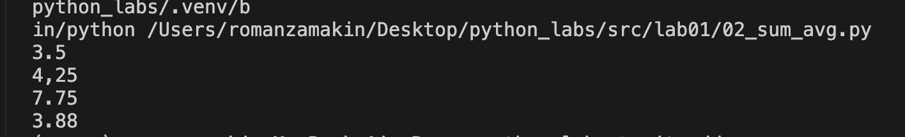
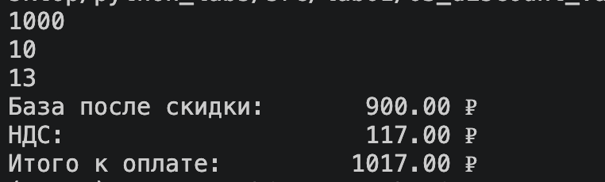
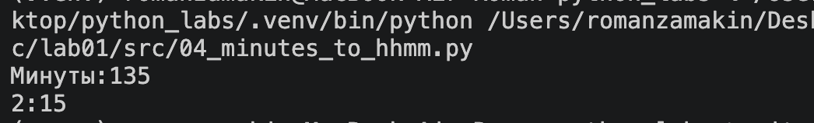
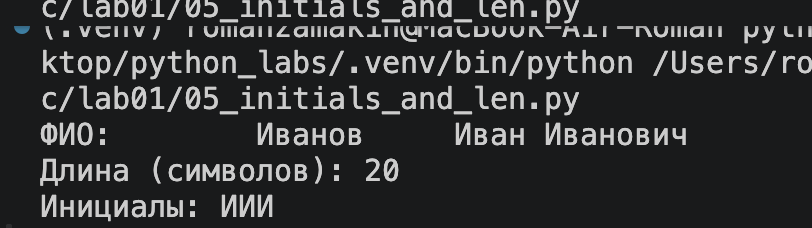
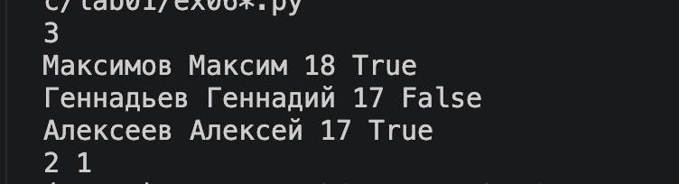
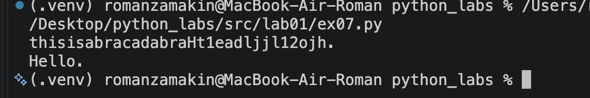

ЛР1 — Ввод/вывод и форматирование

Задание 1
Вывод принта 

Задание 2
С помощью инпутов ввожу 2 числа. Чтобы обеспечить возможность писать с точкой или запятой использую реплейс запятой на точку. Далее вывожу 2 значения: сумма и среднее. 

Задание 3
Получаю 3 числа с плавающей точкой с помощью ввода с клавиатуры. По трем формулам считаю значения идущие в ответ. С помощью f-строк ровняю текст по правому краю. 

Задание 4
Получаю целое число минут с клавиатуры. Далее вывожу время как на электронных часах вида ЧЧ:ММ. 

Задание 5
Получаю ФИО с клавиатуры. Считаю количество символов в строчке(все буквы и 2 пробела между ФИО). Чтобы найти инициалы прохожу по всей строке по парам. Необходимо создать пустую строку, куда будут идти сами инициалы и счетчик инициалов. Проверяю, что инициалы идут после пробела и добавляю в строку. Если было добавлено всего 2 буквы, значит первый символ строки должен быть добавлен в список инициалов. Далее вывожу длину и инициалы. 

Задание 6*
Получаю одно число n с клавиатуры обозначающее количество строк. Далее будут введены n строк  со всеми входными данными через пробел в каждой(Имя Фамилия Возраст Форма обучения). Каждый тип данных идет в свою переменную с помощью map. Для ответа необходимо смотреть только на последнюю переменную. Если она показыват очную форму обучения то к ранее созданному счетчику прибавляется единица. В ответ идет значение с счетчика и общее число строк минус количество с очной формой. 

Задание 7*
Получаю запутанную строку с клавиатуры. Далее нахожу Первую заглавную букву. Записываю ее координату и ее саму. Далее нахожу первый символ после цифры идущей за заглавной и записываем те же данные как с предыдущей буквой. Нахожу значение шага. Далее прохожусь по оставшейся строчке через такой шаг и записываю буквы. Цикл завершается когда найдена точка. Вывожу загаданную строку. 