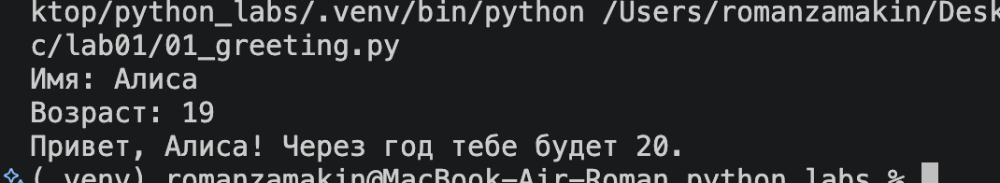

ЛР1 — Ввод/вывод и форматирование

Задание 1
Вывод принта 

Задание 2
С помощью инпутов ввожу 2 значения. Чтобы обеспечить возможность писать с точкой или запятой использую реплейс запятой на точку. Далее вывожу 2 