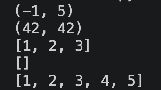

ЛР2 — Коллекции и матрицы (list/tuple/set/dict)

Задание 1:

```python
def min_max(nums):
    if len(nums) == 0:
        raise ValueError("пустой список")

    minimum = nums[0]
    maximum = nums[0]

    for x in nums:
        if x < minimum:
            minimum = x
        if x > maximum:
            maximum = x
    return (minimum, maximum)
print(min_max([3, -1, 5, 5, 0]))    # (-1, 5)
print(min_max([42]))                # (42, 42)
```


Задание 