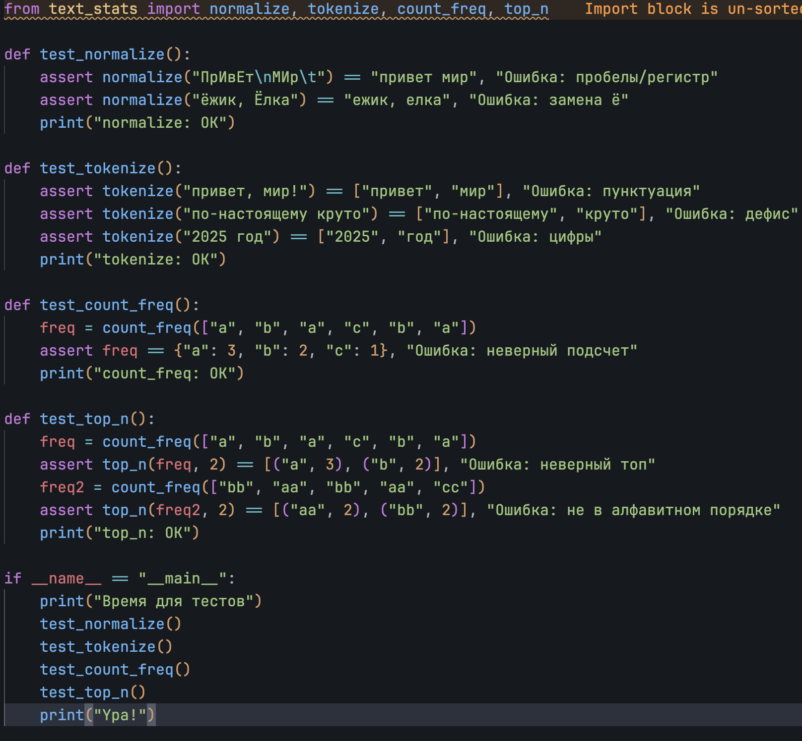
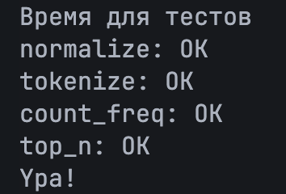
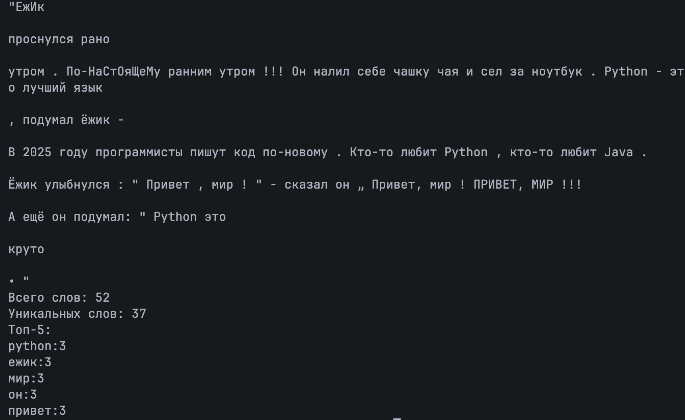
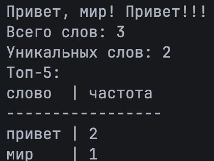

# Лаба 3

## Задание А - модуль с функциями

В переиспользуемом модуле `src/lib/text.py` хранятся чистые функции (без ввода/вывода) для работы с текстом: нормализация, токенизация, подсчёт частот и топ-N слов.

### normalize()

Приводит строку к нормальному виду: casefold (или lower), замена ё --> е, управляющие символы (`\t`, `\r`, `\n` и т.п.) заменяются пробелами, повторяющиеся пробелы схлопываются, края обрезаются.

```python
import re

_CONTROL_RE = re.compile(r"[\x00-\x1f\x7f-\x9f]")
_SPACES_RE = re.compile(r"\s+")
_TOKEN_RE = re.compile(r"\w+(?:-\w+)*")


def normalize(text: str, *, casefold: bool = True, yo2e: bool = True) -> str:
    """Привести текст к нормальному виду."""
    if yo2e:
        text = text.replace("ё", "е").replace("Ё", "Е")  # ё -> е
    text = text.casefold() if casefold else text.lower()
    text = _CONTROL_RE.sub(" ", text)  # \t, \r, \n -> пробел
    return _SPACES_RE.sub(" ", text).strip()  # схлопнуть пробелы
```

### tokenize()

Разбивает текст на слова с помощью регулярного выражения `\w+(?:-\w+)*`. Дефис внутри слова сохраняется (`по-настоящему` остаётся одним токеном), а знаки препинания, длинное тире и эмодзи работают как разделители и пропадают. Числа считаются словами.

```python
def tokenize(text: str) -> list[str]:
    """Разбить текст на слова (\\w+ и дефис внутри слова)."""
    return _TOKEN_RE.findall(text)
```

### count_freq() и top_n()

`count_freq` считает, сколько раз встретился каждый токен. `top_n` возвращает N самых частых слов (по умолчанию 5): сначала по убыванию частоты, при равенстве - по алфавиту.

```python
def count_freq(tokens: list[str]) -> dict[str, int]:
    """Подсчитать частоты слов."""
    freq: dict[str, int] = {}
    for token in tokens:
        freq[token] = freq.get(token, 0) + 1
    return freq


def top_n(freq: dict[str, int], n: int = 5) -> list[tuple[str, int]]:
    """Топ-N по убыванию частоты, при равенстве по алфавиту."""
    return sorted(freq.items(), key=lambda item: (-item[1], item[0]))[:n]
```

### Мини-тесты





## Задание B - text_stats

Скрипт `src/lab03/text_stats.py` читает весь ввод из stdin (до EOF), нормализует и токенизирует его функциями из `lib/text.py`, считает общее количество слов, количество уникальных слов и выводит топ-5 самых частых слов.

Пустой ввод игнорируется: скрипт просто завершается без вывода.

Дополнительно (со звёздочкой) реализован табличный вывод. Он включается константой `USE_TABLE_VIEW = True` в начале файла. Ширина столбца «слово» подбирается по самому длинному слову из топа.

```python
import sys
from pathlib import Path

sys.path.append(str(Path(__file__).resolve().parent.parent))

from lib.text import count_freq, normalize, tokenize, top_n

USE_TABLE_VIEW = False


def main():
    raw_input = sys.stdin.read()
    if not raw_input.strip():
        return

    words = tokenize(normalize(raw_input))
    freq = count_freq(words)
    top_words = top_n(freq, n=5)

    print(f"Всего слов: {len(words)}")
    print(f"Уникальных слов: {len(freq)}")
    print("Топ-5:")

    if USE_TABLE_VIEW and top_words:
        col_width = max(len("слово"), max(len(w) for w, _ in top_words))
        print(f"{'слово':<{col_width}} | частота")
        print("-" * (col_width + 11))
        for word, count in top_words:
            print(f"{word:<{col_width}} | {count}")
    else:
        for word, count in top_words:
            print(f"{word}:{count}")


if __name__ == "__main__":
    main()
```

### Примеры




## Как запустить

### Вручную, с клавиатуры

В терминале из корня репозитория:

```bash
python src/lab03/text_stats.py
```

Курсор будет ждать ввода. Нужно:

1. Напечатать или вставить текст (можно несколько строк, переход на новую строку - Enter).
2. Завершить ввод сигналом EOF:
   - Windows / PowerShell: `Ctrl+Z`, затем `Enter`
   - Linux / macOS: `Ctrl+D`

После этого появится статистика.

### Через pipe

```bash
echo "Привет, мир! Привет!!!" | python src/lab03/text_stats.py
```

### Из файла

```bash
python src/lab03/text_stats.py < data/sample.txt
```
